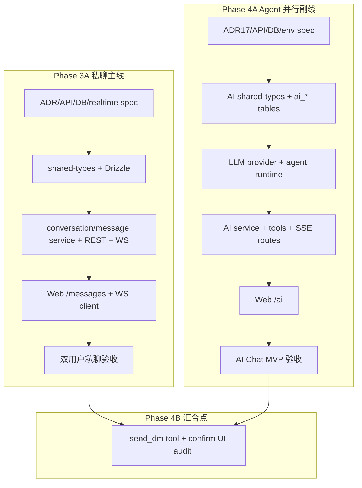

# Phase 3 + Agent 总控实施计划

> **状态**：执行中（2026-07-03）  
> **范围**：Phase 3A 私聊 MVP + Phase 4A AI Chat MVP；Phase 4B Agent 写操作作为 3A 验收后的汇合点。  
> **执行原则**：主线串行保质量，独立轨道并行提速；除非遇到产品/权限/外部依赖阻塞，否则持续推进到可验收交付。

---

## 目标

交付一个完整可用的 P3 + Agent 开发成果：

- 用户可以在 Web 上进行 1:1 私聊，消息通过 REST 写入数据库并通过 WebSocket 实时推送。
- 用户可以在 Web 上与内置 AI Agent 聊天，后端调用本地模型服务并通过 SSE 流式返回。
- Agent MVP 支持闲聊、讲笑话、简单小游戏、只读联系人搜索。
- Agent 写私聊消息（`send_dm`）不进入 4A；在 3A 验收后作为 4B 通过用户确认和审计接入。

---

## 执行地图

---

## 当前进度快照

### 已完成或基本完成

- P3A ADR 13–15 草案与 `api-spec.md` / `db-schema.md` / `realtime-spec.md` 已扩展。
- P3A `Conversation` / `Message` / WS shared-types 已新增。
- P3A `conversations` / `conversation_members` / `messages` schema 与 migration 已生成。
- P3A REST routes、conversation/message services、ChatHub、`/ws/v1/chat` 已实现。
- P3A Web `/messages` 列表、`/messages/[id]` 聊天窗、用户页 Message 入口已实现。
- 浏览器 WS 握手已支持 query fallback：`deviceId`、`platform`。
- 4A ADR 17 与 `phase-4a-plan.md` 已新增。
- 4A `Agent` / `AiConversation` / `AiMessage` shared-types 已新增。
- 4A `agents` / `ai_conversations` / `ai_messages` schema 与 migration 已生成。
- 最近一次 `pnpm type-check` 与 `pnpm --filter @orbitchat/server test` 通过。

### 尚未完成

- P3A read receipt WS 广播、route/service 覆盖测试、浏览器双用户手动验收。
- P3A docs 状态从 Draft 收敛到 Accepted / Closeout。
- 4A env 契约、AI REST/SSE API spec 细化、后端 runtime/service/routes、Web `/ai`。
- 4B `send_dm` 写操作工具、用户确认 UI、`ai_tool_calls` 审计。

---

## 任务树与依赖

### Track P3-1：私聊契约收敛

| 任务 | 输出 | 依赖 | 可并行 |
|------|------|------|--------|
| P3-1.1 | ADR 13–15 状态更新为 Accepted | 当前实现与文档一致 | 可与 P3-2/P3-3 并行 |
| P3-1.2 | `realtime-spec.md` 补最终握手、事件、read receipt | WS 实现 | 可与测试并行 |
| P3-1.3 | `api-spec.md` 对齐 REST 实际行为 | routes 实现 | 可与测试并行 |
| P3-1.4 | `db-schema.md` 对齐索引、唯一约束、cursor 查询 | schema/migration | 可与测试并行 |

### Track P3-2：私聊后端补齐

| 任务 | 输出 | 依赖 | 可并行 |
|------|------|------|--------|
| P3-2.1 | `message.read` WS broadcast | `markConversationRead` | 可与 Web read 状态并行 |
| P3-2.2 | conversations route tests | REST routes | 可与 P3-2.3 并行 |
| P3-2.3 | message service tests | service 层 | 可与 P3-2.2 并行 |
| P3-2.4 | WS auth/query fallback tests | WS auth | 可与 docs 并行 |
| P3-2.5 | migration 可运行确认 | DB 可用 | 验收前串行 |

### Track P3-3：私聊 Web 补齐

| 任务 | 输出 | 依赖 | 可并行 |
|------|------|------|--------|
| P3-3.1 | `/messages` 会话列表状态稳定 | REST + WS | 可与后端测试并行 |
| P3-3.2 | `/messages/[id]` 历史、发送、实时接收稳定 | REST + WS | 可与 P3-3.1 并行 |
| P3-3.3 | 进入聊天自动 mark read，列表未读更新 | read API | 依赖 P3-2.1 |
| P3-3.4 | 断线/刷新后的历史补齐 | REST 历史 | 可与手动验收并行 |
| P3-3.5 | 用户 Profile Message 入口验收 | create conversation API | 可与 P3-3.1 并行 |

### Track AI-1：Agent 契约与数据

| 任务 | 输出 | 依赖 | 可并行 |
|------|------|------|--------|
| AI-1.1 | `env.ts` / `env.md` 增加 LLM 配置 | ADR 17 | 可与 AI-1.2 并行 |
| AI-1.2 | `api-spec.md` 细化 `/api/v1/ai/*` 与 SSE | ADR 17 | 可与 AI-1.1 并行 |
| AI-1.3 | `db-schema.md` 展开 `agents`、`ai_conversations`、`ai_messages` | schema | 可与 AI-1.2 并行 |
| AI-1.4 | seed 内置 Agent | agents table | 依赖 migration |

### Track AI-2：Agent Runtime

| 任务 | 输出 | 依赖 | 可并行 |
|------|------|------|--------|
| AI-2.1 | `LLMProvider` 接口 | AI shared-types | 可与 AI service 并行设计 |
| AI-2.2 | OpenAI-compatible/Ollama provider | env | 依赖 AI-2.1 |
| AI-2.3 | timeout + 并发限制 | env | 与 provider 并行 |
| AI-2.4 | orchestrator 单轮回复 | provider | 依赖 AI-2.2 |
| AI-2.5 | tool registry + readonly tool contract | runtime 接口 | 与 AI-2.4 并行 |
| AI-2.6 | joke / tic-tac-toe 简单能力 | orchestrator/tool | 依赖 AI-2.4/2.5 |

### Track AI-3：Agent 后端服务与路由

| 任务 | 输出 | 依赖 | 可并行 |
|------|------|------|--------|
| AI-3.1 | agent/conversation/message mappers | schema | 可与 runtime 并行 |
| AI-3.2 | AI conversation service | schema | 可与 AI-3.3 并行 |
| AI-3.3 | AI message persistence | schema | 可与 AI-3.2 并行 |
| AI-3.4 | `search_contact` readonly tool executor | Phase 2 search | 可与 AI-3.2 并行 |
| AI-3.5 | `routes/v1/ai.ts` list/create/message/SSE | AI service + runtime | 依赖 AI-2/3 |
| AI-3.6 | provider/service/route tests | routes | 与 Web 并行 |

### Track AI-4：Agent Web

| 任务 | 输出 | 依赖 | 可并行 |
|------|------|------|--------|
| AI-4.1 | `lib/api/ai.ts` | AI routes | 可与 UI skeleton 并行 |
| AI-4.2 | `/ai` 页面：Agent 选择、会话列表 | AI API | 可与 AI-4.3 并行 |
| AI-4.3 | SSE token 渲染与消息落屏 | SSE route | 依赖 AI-3.5 |
| AI-4.4 | joke / game UI 基础展示 | AI message content | 可与 AI-4.3 并行 |
| AI-4.5 | 错误态、loading、空态 | UI skeleton | 可与 AI-4.2 并行 |

### Track 4B：Agent 写操作汇合（3A + 4A 验收后）

| 任务 | 输出 | 依赖 | 可并行 |
|------|------|------|--------|
| 4B-1 | `ai_tool_calls` schema + migration | 4A service | 与 docs 并行 |
| 4B-2 | `send_dm` tool draft 操作 | P3A message-service | 依赖 P3A 验收 |
| 4B-3 | 用户确认 UI | Web `/ai` | 与 backend audit 并行 |
| 4B-4 | audit status：pending/approved/rejected/executed/failed | schema | 依赖 4B-1 |
| 4B-5 | 端到端验收：Agent 草拟，用户确认后发私聊 | P3A + 4A | 最后串行 |

---

## 并行策略

- **立刻并行**：P3 文档收敛、P3 测试、AI env/API/DB 文档。
- **后端并行**：P3 read receipt 与 AI runtime/provider 可以同时推进，因为模块边界独立。
- **Web 并行**：`/messages` polish 与 `/ai` skeleton 可以同时推进，但最终验收分别依赖各自后端。
- **必须串行**：数据库 migration 运行、3A 双用户验收、4B `send_dm` 接入。

---

## 验收清单

### P3A 私聊

- [ ] 用户 A/B 登录两个 Web 会话，A 发送消息，B 在 1 秒内收到 `message.new`。
- [ ] 刷新 `/messages/[id]` 后历史消息完整、顺序正确。
- [ ] 进入聊天页会更新 `last_read_at`，列表未读数归零。
- [ ] WebSocket 鉴权支持 Header 与浏览器 query fallback。
- [ ] REST route/service 测试覆盖成功路径与权限边界。
- [ ] `pnpm type-check`、server tests、web build/lint（如可运行）通过。

### 4A Agent

- [ ] `LLM_BASE_URL`、`LLM_MODEL`、timeout、并发限制可配置。
- [ ] 用户可以创建 AI 会话并发送消息。
- [ ] 后端持久化用户消息与 assistant 消息。
- [ ] SSE 能流式返回 token 或 delta，完成后返回 `message.done`。
- [ ] 无本地模型服务时返回清晰错误，不影响普通 REST / P3 WS。
- [ ] 内置 Agent 可以讲笑话、执行简单小游戏回合。
- [ ] `search_contact` 只读 tool 可以返回候选联系人。

### 4B Agent 写操作

- [ ] Agent 不直接写业务库，只生成 pending tool call。
- [ ] 用户确认后通过 `message-service` 执行 `send_dm`。
- [ ] `ai_tool_calls` 记录输入、输出、状态、执行者与时间。
- [ ] 用户拒绝或执行失败有可恢复 UI 状态。

---

## 工作方式

后续执行按以下节奏持续推进：

1. 先完成 P3A 的稳定性、测试和验收准备。
2. 同步推进 AI-1/AI-2，保证 Agent 后端不阻塞。
3. P3A 可验收后，继续完成 4A 后端与 `/ai` 页面。
4. 4A 可验收后，再接 4B `send_dm`，除非用户明确要求先暂停在 4A。
5. 每个较大阶段会更新 TODO 与简短进展，但不再把“小节完成”当成停工点。

---

## 风险与处理

- **本地模型不可用**：AI route 保持明确错误与 mockable provider；不阻塞 P3A。
- **浏览器 WS Header 限制**：已采用 query fallback，并记录在 realtime spec。
- **未读计数准确性**：3A 用 conversation member `last_read_at`，不做逐条 read receipt。
- **Agent 写操作安全**：4A 不做写操作；4B 必须有用户确认与审计。
- **变更面大**：保持 shared-types → schema → service → route → web 的顺序，避免前后端契约漂移。

