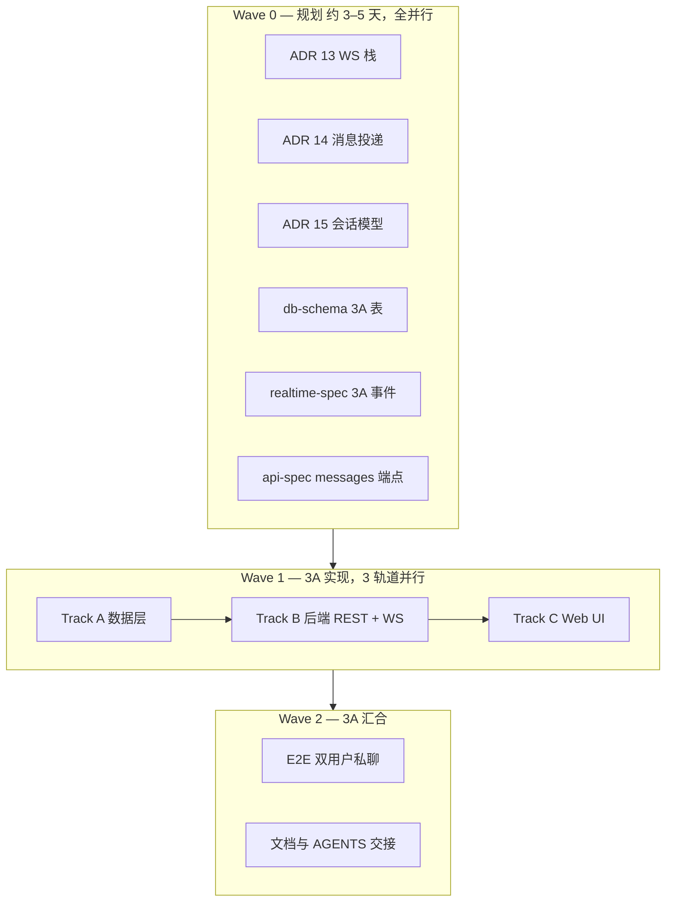

# Phase 3 实施计划（3A 私聊 + 3B 群聊）

> **交付回顾**：[phase-3-4-delivery.md](./phase-3-4-delivery.md)  
> **前置**：[phase-3-kickoff.md](./phase-3-kickoff.md)  
> **原则**：文档 / ADR 先行；3A 已验收；3B 启动前需 ADR 16。

---

## 总览



| 里程碑 | 目标 | 估计 |
|--------|------|------|
| **3A** | 1:1 私聊 MVP（REST + WS + Web） | 3–4 周 |
| **3B** | 群聊 + typing + 可选 session.revoked WS | +2–3 周 |
| **3.1** | FCM/APNs、通知中心（可选） | 另列 |

---

## Wave 0 — 规划（**全部可并行**）

> 完成标准：ADR Accepted；`db-schema` / `realtime-spec` / `api-spec` 3A 章节定稿；**仍不写业务代码**。

| 轨道 | 产出 | 负责人建议 | 依赖 |
|------|------|------------|------|
| **W0-A** | [ADR 13](./decisions/13-websocket-stack.md) — WebSocket（Bun + Hono WS，单进程，无 Redis） | 后端 | 无 |
| **W0-B** | [ADR 14](./decisions/14-message-delivery.md) — REST 写库 + WS 广播 | 后端 | 与 W0-A 可并行 |
| **W0-C** | [ADR 15](./decisions/15-conversation-model.md) — 1:1 `conversations` / `members` / `messages` | 后端 | 与 W0-A/B 可并行 |
| **W0-D** | `db-schema.md` Phase 3A 详表 + 索引说明 | 后端 | 对齐 ADR 15 |
| **W0-E** | `realtime-spec.md`：连接、心跳、`message.new`/`ack` payload、错误帧 | 全栈 | 对齐 ADR 13–14 |
| **W0-F** | `api-spec.md`：`/conversations`、`/messages`、cursor | 全栈 | 对齐 ADR 15 |

**汇合门禁**：`pnpm` 无代码变更；评审通过 → 进入 Wave 1。

---

## Wave 1 — Phase 3A 实现

### 依赖关系（什么必须先做）

```text
shared-types（契约）
    ↑
Drizzle migration ──→ message-service ──→ REST routes
                              ↓
                        WS hub / broadcast
                              ↓
                        Web lib/api + UI
```

### 三轨道并行明细

#### Track A — 数据与类型（第 1 周，可与 W0 末尾重叠）

| # | 任务 | 并行 |
|---|------|------|
| A1 | `shared-types`：`Conversation`、`Message`、`WsMessage`  envelope | 与 A2 并行 |
| A2 | Drizzle：`conversations`、`conversation_members`、`messages` + migration | 与 A1 并行 |
| A3 | `db-schema.md` 与 schema 对齐 | 依赖 A2 |

#### Track B — 后端（第 1–2 周）

| # | 任务 | 并行 |
|---|------|------|
| B1 | `conversation-service`：创建/查找 1:1 会话（两用户唯一） | A2 完成后 |
| B2 | `message-service`：发消息、拉历史 cursor、更新 `last_read_at` | 与 B1 并行（同层） |
| B3 | `routes/v1/conversations.ts` REST | 依赖 B1/B2 |
| B4 | WS 模块：`/ws/v1/chat` 握手（JWT + Session） | **与 B3 并行** |
| B5 | WS：`message.new` 推送给在线成员；`message.ack` | 依赖 B4 |
| B6 | 单测：`conversation-service`、`message-service`、WS envelope | 与 B5 并行 |

#### Track C — Web（第 2–3 周，REST 契约就绪后可启动）

| # | 任务 | 并行 |
|---|------|------|
| C1 | `lib/api/conversations.ts`、`messages.ts` | **与 B3 并行**（mock 或 staging API） |
| C2 | `/messages` 会话列表页 | 依赖 C1 |
| C3 | `/messages/[id]` 聊天窗 + 历史滚动 + 发消息 | 依赖 C1 |
| C4 | WS client：连接、重连、`message.new` 追加到列表 | **与 C3 并行**（依赖 B4 联调） |
| C5 | Profile / 用户页「发消息」入口 | 与 C2/C3 并行 |

**Track B4 + C4 联调** 是 3A 的关键路径（Critical Path）。

---

## Wave 2 — 3A 验收（**部分可并行**）

| # | 任务 | 并行 |
|---|------|------|
| V1 | E2E：双 browser context 私聊收发 | 与 V2 并行 |
| V2 | server 路由集成测试 + WS 帧单测 | 与 V1 并行 |
| V3 | 更新 `AGENTS.md`、`roadmap`、Phase 3A closeout 文档 | 依赖 V1 通过 |
| V4 | 浏览器粗测：断线重连、刷新历史 | 依赖 V4 可选 |

### 3A 成功标准

- [ ] 用户 A/B 各开 Web，A 发消息 B **< 1s** 收到（同机 localhost）
- [ ] 刷新页面后 REST 拉取历史完整、顺序正确
- [ ] 未读：`last_read_at` 进入会话后更新
- [ ] `pnpm type-check` / `lint` / `test` / `e2e` 通过
- [ ] ADR 13–15 Accepted；`realtime-spec` 3A 章节定稿

---

## Phase 3B — 群聊（3A 合并 `main` 后）

> 3B 内部也可并行，但 **依赖 3A WS 基础设施**。

| 轨道 | 任务 | 并行 |
|------|------|------|
| **B0** | ADR 16（可选）：群模型与权限 | 与 db 设计并行 |
| **B-Data** | `chat_groups`、`chat_group_members`、群消息扩展 | — |
| **B-API** | 建群、邀请、踢人、群历史 REST | **与 B-WS 并行** |
| **B-WS** | `roomId = groupId` 广播 | **与 B-API 并行** |
| **B-Web** | 群列表、群聊 UI | 依赖 B-API 契约 |
| **B-Opt** | `typing.*`、`session.revoked` WS | 可选，与 B-Web 并行 |

---

## Phase 3.1 — 延后

| 项 | 说明 |
|----|------|
| FCM / APNs | 独立 ADR + mock |
| 通知中心 | 可与 Phase 2.1 `blocks` 一并规划 |
| Redis Pub/Sub | 多实例部署时再上 |
| 逐条已读回执 | `message_reads` 表 |

---

## 与 Phase 2 的并行关系

| 工作 | 能否与 Phase 3 Wave 0 并行 |
|------|---------------------------|
| Phase 2 **push / PR 合 main** | ✅ 应优先做，与 W0 并行 |
| Phase 2.1（粉丝页、pg_trgm） | ✅ 与 W0 或 3A Track C 并行 |
| Phase 3A 编码 | ❌ 等 W0 门禁通过 |

---

## 与 Phase 4A（AI Chat MVP）的并行关系

> AI 4A 可以提前规划并与 3A 并行实现，但 **Agent 写操作 Tool** 必须等 3A 消息服务验收。

| 工作 | 能否与 Phase 3A 并行 | 说明 |
|------|----------------------|------|
| ADR 17：AI Agent 架构、本地模型、Runtime 边界 | ✅ | 可与 ADR 13-15 同时评审 |
| `phase-4a-plan.md`、AI API / DB 草案 | ✅ | 与 3A spec 并行，不改同一文件段落时冲突较小 |
| `ai_*` schema、AI shared-types | ✅ | 使用独立 migration 与独立 domain 文件 |
| AI REST + SSE、`/ai` 页面 | ✅ | 4A 不依赖 WebSocket |
| 只读 Tool：`search_contact` | ✅ | 复用 Phase 2 用户搜索 |
| `send_dm` Tool | ❌ | 依赖 3A `message-service` 和私聊验收 |
| `WS /ws/v1/ai` | ❌ | 4A 不做，避免抢 3A WS 关键路径 |

**汇合点**：3A 验收通过后，Phase 4B 才接入 `send_dm`、用户确认 UI 与 `ai_tool_calls` 审计。

---

## 建议排期（日历级参考）

| 周 | 主线 | 可并行副线 |
|----|------|------------|
| W1 | W0 全部 ADR + spec；Track A 开工 | P2 push/PR；ADR 17 + `phase-4a-plan.md` |
| W2 | Track B REST + WS 骨架；Track C API client | AI `ai_*` schema、Ollama provider、SSE skeleton |
| W3 | B/C 联调；聊天窗 + WS | `/ai` 页面、笑话 / 小游戏、只读 Tool |
| W4 | Wave 2 验收；PR 合 main | AI 4A 验收；准备 4B `send_dm` 汇合 |

---

## 相关文档

| 文档 | 用途 |
|------|------|
| [phase-3-kickoff.md](./phase-3-kickoff.md) | 为什么拆 3A/3B |
| [realtime-spec.md](./realtime-spec.md) | WS 契约（W0-E 扩写） |
| [db-schema.md](./db-schema.md) | 表结构（W0-D） |
| [sql-learning.md](./sql-learning.md) | messages 表索引与 cursor 查询 |
| [phase-2-closeout.md](./phase-2-closeout.md) | P2 关闭与 2.1  backlog |
| [phase-4a-plan.md](./phase-4a-plan.md) | AI 4A MVP 与 P3A 并行关系 |

---

## 版本历史

| 版本 | 日期 | 说明 |
|------|------|------|
| 0.1.0 | 2026-06-30 | 初版：Wave 0–2、3A 三轨道并行、3B/3.1 |
| 0.2.0 | 2026-07-03 | 增加与 Phase 4A AI Chat MVP 的并行关系和汇合点 |
| 0.3.0 | 2026-07-03 | 链接 ADR 13–15 具体决策文档 |
