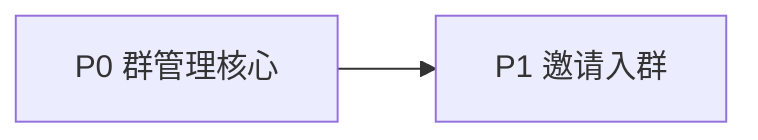

# Phase 3B.1 — 群能力完善计划

> **状态**：Draft（待评审）  
> **日期**：2026-07-06  
> **前置**：[phase-3-4-delivery.md](./phase-3-4-delivery.md)（3B 节）  
> **原稿 closeout**：[phase-3b-4b-closeout.source.md](./phase-3b-4b-closeout.source.md)  
> **基线**：[ADR 16](./decisions/16-group-chat-model.md)

---

## 目标

在 **3B MVP**（建群时拉人、群聊收发、与 1:1 共存）之上，补齐「能管群、能加人、能走人」的产品闭环；邀请链接为 P1。

**不做（本计划）**：群聊 typing、推送（3.1）、Redis 多实例、群头像（4C）、消息编辑删除。

**私聊 typing**：不放在 3B.1，见文末 [附录：Phase 3A.1 私聊 Typing](#附录phase-3a1-私聊-typing仅-11)。

---

## 现状 vs 目标

| 能力 | 3B MVP（当前） | 3B.1 目标 |
|------|----------------|-----------|
| 建群 | 创建时指定 `memberUserIds` | 保持；可空群后拉人（可选） |
| 加人 | 仅建群时 | **群主/管理员事后拉人** |
| 减人 | 无 | **踢人**（设 `left_at`） |
| 主动退群 | 无 | **成员自己 leave** |
| 角色 | 仅 `created_by_user_id` | **`owner` / `admin` / `member`** |
| 转让群主 | 无 | **owner 转让** |
| 改群名 | 无 | **owner/admin 改 title** |
| 邀请链接 | 无 | **P1：邀请码 + 同意入群** |
| 在线状态 | 无 | 延后（presence 另开） |

> **Typing**：仅 **1:1 私聊** 需要「对方正在输入」；**群聊不做 typing**（多人场景噪音大、收益低）。见附录 3A.1。

---

## 分阶段交付（建议顺序）



| 阶段 | 周期（估） | 验收一句话 |
|------|------------|------------|
| **P0** | 1–1.5 周 | 群主能拉人、踢人、改群名；成员能退群 |
| **P1** | 0.5–1 周 | 生成邀请链接，被邀请人同意后入群 |

---

## P0 — 群管理核心（优先做）

### 0. 文档与契约（1–2 天，先于代码）

| # | 产出 |
|---|------|
| 1 | **ADR 18** — 群成员角色与权限矩阵 |
| 2 | `db-schema.md` — `conversation_members.role`、审计字段（可选） |
| 3 | `api-spec.md` — 下文 REST 端点 |
| 4 | `shared-types` — `GroupMemberRole`、请求/响应类型 |
| 5 | `realtime-spec.md` — `member.joined` / `member.left`（可选，见 WS） |

### 1. 数据模型

#### `conversation_members` 扩展

| 字段 | 类型 | 说明 |
|------|------|------|
| `role` | ENUM | `owner` \| `admin` \| `member`；**仅 `type=group`**；direct 成员可为 NULL 或固定 `member` |
| `left_at` | TIMESTAMPTZ | 已有；踢人 / 退群时写入 |
| `joined_at` | TIMESTAMPTZ | 已有 |

**规则**：

- 建群时：创建者 `role=owner`，初始 `memberUserIds` 为 `member`。
- 每群 **有且仅有 1 个 `owner`**（转让后旧 owner 降为 `admin` 或 `member`，由 ADR 定）。
- 查询成员列表默认 `left_at IS NULL`。

#### `conversations`（群）

- `title` 已有；P0 增加 **PATCH 改群名**。
- `created_by_user_id` 保留作审计；**权限以 `role=owner` 为准**（转让后 created_by 可不变或同步更新 — ADR 18 二选一，推荐 **仅 role 驱动权限**）。

**Migration 草图**：`0007_group_member_roles.sql`

```sql
CREATE TYPE conversation_member_role AS ENUM ('owner', 'admin', 'member');
ALTER TABLE conversation_members ADD COLUMN role conversation_member_role;
-- 回填：group 会话中 created_by_user_id 对应成员 → owner，其余 member
```

### 2. 权限矩阵（ADR 18 核心）

| 操作 | owner | admin | member |
|------|-------|-------|--------|
| 发消息 | ✅ | ✅ | ✅ |
| 查看成员列表 | ✅ | ✅ | ✅ |
| 邀请/拉人入群 | ✅ | ✅ | ❌ |
| 踢人（他人） | ✅ | ✅（仅 member） | ❌ |
| 设/撤 admin | ✅ | ❌ | ❌ |
| 转让 owner | ✅ | ❌ | ❌ |
| 改群名 | ✅ | ✅ | ❌ |
| 主动退群 | ✅（需先转让或解散，见下） | ✅ | ✅ |
| 解散群 | ✅（P0 可选：软解散 = 全员 left_at） | ❌ | ❌ |

**owner 退群**：须先 **转让 owner** 或 **解散群**（P0 可只做转让；解散标 P1）。

### 3. REST API（`/api/v1/conversations/:id/...`）

仅 `type=group` 可用；非成员 → `403`。

| 方法 | 路径 | 说明 | 权限 |
|------|------|------|------|
| `GET` | `/conversations/:id/members` | 成员列表（含 role、joinedAt） | 成员 |
| `POST` | `/conversations/:id/members` | 拉人入群 `{ userIds: string[] }` | owner/admin |
| `DELETE` | `/conversations/:id/members/:userId` | 踢人 | owner/admin；admin 不能踢 owner/admin |
| `POST` | `/conversations/:id/leave` | 当前用户退群 | member/admin；owner 需先转让 |
| `PATCH` | `/conversations/:id` | 改群名 `{ title }` | owner/admin |
| `POST` | `/conversations/:id/transfer-owner` | `{ newOwnerUserId }` | owner |
| `PATCH` | `/conversations/:id/members/:userId` | 改角色 `{ role: 'admin' \| 'member' }` | owner |

**行为细节**：

- **拉人**：目标用户存在、未在群内、`userIds` 去重；写入 `conversation_members`，`role=member`，`joined_at=now`。
- **踢人**：设 `left_at=now`；若在线 WS，可推 `member.left`（可选）。
- **退群**：同踢自己；owner 调用 → `VALIDATION_ERROR` + 提示先转让。
- **重复拉已离开的人**：允许再入群（新 `joined_at`，或 UPDATE 清空 `left_at` — 推荐 **复用行 UPDATE** 以保持 UNIQUE(conversation_id, user_id)）。

**`Conversation` DTO 扩展（可选）**：

```typescript
viewerRole: 'owner' | 'admin' | 'member' | null; // 仅 group；direct 为 null
```

### 4. WebSocket（可选但推荐）

房间仍为 `conversation:{id}`（ADR 16）。

| 事件 | 方向 | Payload 要点 |
|------|------|----------------|
| `member.joined` | S→C | `conversationId`, `member: ConversationParticipant & { role }` |
| `member.left` | S→C | `conversationId`, `userId`, `reason: 'kicked' \| 'left'` |

成员被踢/退群后：服务端将其移出房间订阅（若 ChatHub 有 per-user room 管理则 drop join）。

**P0 可降级**：仅 REST，靠列表刷新；有 WS 体验更好。

### 5. Web UI

| 页面/组件 | 内容 |
|-----------|------|
| `/messages/[id]` 群聊 | 标题旁 **群信息** 入口（齿轮或 info） |
| **群信息抽屉/页** `/messages/[id]/settings` | 群名编辑、成员列表（头像+昵称+role 标签） |
| owner/admin | 「添加成员」→ 复用搜索 UI（同 new-group） |
| owner/admin | 成员行 **移除**；owner 对 member 行 **设为管理员** |
| owner | **转让群主** 选择器 |
| 所有非 owner | **退出群聊** 按钮 |
| `/messages` 列表 | 退群/被踢后该群从列表消失（`left_at` 过滤已有） |

### 6. 测试

| 类型 | 覆盖 |
|------|------|
| Server route tests | 各端点权限矩阵（403/400） |
| Service tests | 拉人、踢人、转让、owner 退群拒绝 |
| E2E | 三账号：A 建群 → B 拉入 C → A 踢 C → C 列表无群；B 退群 |

### P0 验收清单

- [ ] 群主建群后可在群设置里 **追加成员**
- [ ] 被追加用户 **无需确认** 即出现在 `/messages`（与现建群一致）
- [ ] 群主/管理员可 **踢人**；被踢用户无法再发消息、看不到群（或 403）
- [ ] 普通成员可 **退群**
- [ ] 群主可 **转让**；原群主降为 admin（或 member，ADR 定）
- [ ] 群主/管理员可 **改群名**；列表与聊天窗标题同步
- [ ] E2E 1 条 + server tests 通过

---

## P1 — 邀请入群

### 场景

用户 B 分享链接给 C，C 打开后 **确认加入**（避免被随便拉进骚扰群）。

### 数据模型

**`group_invites`**（新表，仍挂在 `conversation_id`）

| 字段 | 类型 | 说明 |
|------|------|------|
| id | UUID PK | |
| conversation_id | UUID FK | |
| code | VARCHAR(32) UNIQUE | 短码或 token |
| created_by_user_id | UUID FK | |
| expires_at | TIMESTAMPTZ | 可空；默认 7 天 |
| max_uses | INT | 可空；默认无限 |
| use_count | INT | |
| revoked_at | TIMESTAMPTZ | 可空 |
| created_at | TIMESTAMPTZ | |

### API

| 方法 | 路径 | 说明 |
|------|------|------|
| `POST` | `/conversations/:id/invites` | 创建邀请 `{ expiresInHours?, maxUses? }` |
| `GET` | `/conversations/:id/invites` | 群主/admin 列出现有邀请 |
| `DELETE` | `/invites/:code` | 撤销邀请 |
| `GET` | `/invites/:code` | 公开预览：群名、成员数、邀请人（需登录） |
| `POST` | `/invites/:code/accept` | 当前用户加入群 |

### Web

- 群设置：**生成邀请链接**、复制、撤销
- `/join/:code` 或 `/invites/:code`：预览 + **加入群聊** 按钮

### P1 验收

- [ ] 链接过期 / 撤销后无法接受
- [ ] 已在群内用户重复 accept → 200 幂等
- [ ] E2E：A 建群 → 生成链接 → C 打开加入 → C 能收发消息

---

## 附录：Phase 3A.1 私聊 Typing（仅 1:1）

> **与 3B.1 解耦**：可单独分支 `feat/phase-3a1-typing`，不阻塞群管理。

### 产品理由

- **私聊**：两人对话，「对方正在输入…」信号清晰、价值高。
- **群聊**：多人同时输入时文案嘈杂（「A、B 正在输入…」），易干扰阅读；**明确不做**。

### 行为

- 仅当 `conversation.type === 'direct'` 时，客户端发 typing 事件。
- 服务端校验会话类型，**群聊收到 typing 帧直接忽略或 `error`**。
- 聊天窗底部：`{displayName} 正在输入…`（只显示**对方**一人）。

### WS（`realtime-spec` 已有占位）

```typescript
// C→S（仅 direct 会话）
{ type: 'typing.started', payload: { conversationId } }
{ type: 'typing.stopped', payload: { conversationId } }

// S→C → 广播给会话中**另一名**成员
{ type: 'typing.started', payload: { conversationId, userId, displayName } }
```

### 实现要点

- ChatHub 内存 TTL；不持久化。
- debounce 300ms started；3s 无输入或 blur 发 stopped。
- 限流：每用户每会话 1s 最多 1 次 started。

### 验收

- [ ] 双用户私聊：A 输入时 B 看到提示；B 看不到自己的 typing。
- [ ] 群聊窗：**无** typing UI、无 WS 广播。
- [ ] E2E 1 条（可并入 `chat-agent-flow.spec.ts`）。

### 估时

~0.5 周（可与 3B.1 **并行**不同分支，无依赖）。

---

## 实现顺序（单分支建议）

```text
ADR 18 + api-spec + shared-types
    ↓
migration 0007（role）
    ↓
group-member-service（权限校验集中）
    ↓
REST routes（P0 端点）
    ↓
WS member.*（可选并行）
    ↓
Web 群设置 UI
    ↓
E2E + closeout phase-3b1-group-closeout.md
    ↓
（另 PR）P1 invites 表 + 加入流
```

**推荐分支名**：`feat/phase-3b1-group`（P0 合一次；P1 follow-up PR）。

**并行可选**：`feat/phase-3a1-typing`（私聊 typing，与 3B.1 无依赖）。

---

## 与现有代码衔接

| 文件 | 改动方向 |
|------|----------|
| `conversation-members.ts` | 增加 `role` enum 列 |
| `conversation-service.ts` | 建群写 role；抽出 `assertGroupPermission` |
| 新建 `group-member-service.ts` | 拉人/踢人/退群/转让/改角色 |
| `conversation-loaders.ts` | 成员列表含 role |
| `chat-hub.ts` | 可选 `member.*` 广播 |
| `messages/[id]/page.tsx` | 群设置入口 |
| 新建 `messages/[id]/settings/page.tsx` | 群管理 UI |

---

## 明确不做（本计划内）

| 项 | 归属 |
|----|------|
| **群聊 typing** | **不做**（产品决策）；私聊见 3A.1 附录 |
| 入群审批（管理员同意才进） | 可挂在 P1 invite 的 `require_approval` 扩展，默认不做 |
| 群 @ 提醒 | 后续 |
| 群公告、群头像 | 4C 多媒体后 |
| 禁言 | 后续 |
| 消息已读回执（逐条） | ADR 14 延后项 |
| Redis 多实例 | 部署阶段 |

---

## 文档汇合（每阶段结束）

- [ ] `product.md` / `roadmap.md` 群能力状态
- [ ] `AGENTS.md` 交接
- [ ] `phase-3b1-group-closeout.md`（P0 完成后）
- [ ] ADR 18 Accepted

---

## 本地开发速查（P0 完成后预期）

```bash
git checkout feat/phase-3b1-group
pnpm dev
# 用户 A 建群 → 群设置 → 添加 B → B /messages 可见
# A 踢 B 或 B 退群 → 验证 403 / 列表消失
```

---

## 相关文档

- [ADR 16 — 群聊模型](./decisions/16-group-chat-model.md)
- [phase-3-4-delivery.md](./phase-3-4-delivery.md)
- [realtime-spec.md](./realtime-spec.md)
- [api-spec.md](./api-spec.md)
