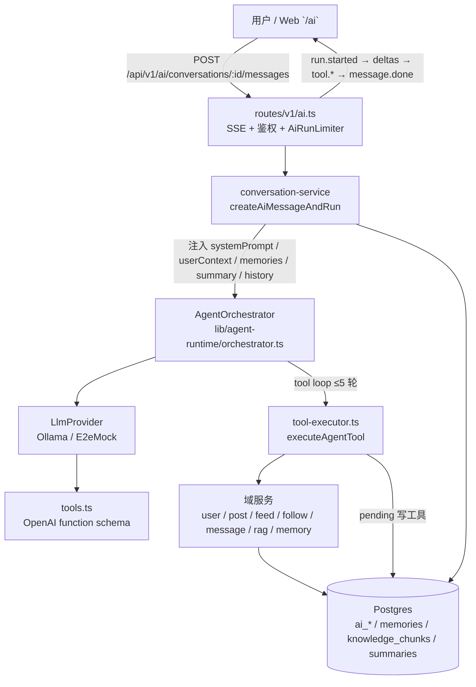
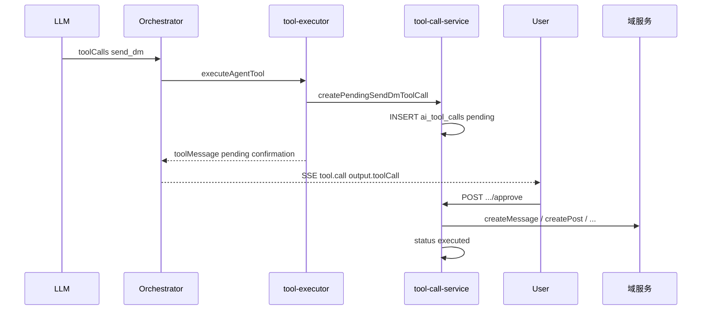

# 小轨（Orbit Guide）Agent 实现学习指南

> **读者**：想理解 Orbitchat 内置 AI 助手「小轨」如何从 HTTP 请求一路走到 LLM、Tool、落库的开发者。  
> **前置阅读**：[AGENTS.md](../AGENTS.md)、[phase-4-orbit-guide-plan.md](./phase-4-orbit-guide-plan.md)、[ADR 17](./decisions/17-ai-agent-architecture.md)  
> **API 契约**：见 [api-spec.md § AI](./api-spec.md)（本文不重复完整 endpoint 定义）

**最后更新**：2026-07-09（Wave 1–5 已落地）

---

## 1. 小轨是什么

**小轨**（slug：`orbit-guide`）是 Orbitchat **站内社交助手**，不是通用 ChatGPT 替代品。

| 维度 | 小轨 | 通用 ChatGPT |
|------|------|--------------|
| 知识来源 | 平台 Tool（profile、帖子、RAG）、用户显式记忆 | 训练数据 + 联网（若开启） |
| 写操作 | 发私信、发帖、关注等 **必须用户 Approve** | 无平台写权限 |
| 记忆 | 用户可控的 `user_agent_memories`（可删） | 厂商黑盒 |
| 游戏/娱乐 | 井字棋状态持久化在 `ai_conversations.tictactoe_data` | 无 |
| 部署 | 本地 Ollama / OpenAI-compatible API | 云服务 |

**产品边界**（详见 [phase-4-orbit-guide-plan.md §1](./phase-4-orbit-guide-plan.md)）：

- ✅ 帮用户在本站聊天、查资料、下棋、经确认后代操作
- ❌ 通用搜索引擎、自动发帖机器、未经同意的隐私采集

人设与能力说明写在 `agents.system_prompt`（启动时由 `ensureBuiltinAgents()` upsert），当前默认 Agent 定义见 `conversation-service.ts` 中的 `DEFAULT_AGENT`。

---

## 2. 架构总览



**分层原则**（[ADR 17](./decisions/17-ai-agent-architecture.md)）：

- **Route**：HTTP、SSE、并发限制、错误信封
- **Service**：会话/消息落库、上下文组装、记忆加载
- **Runtime**（`lib/agent-runtime/`）：与业务无关的 LLM 对话循环
- **ToolExecutor**：唯一业务 Tool 入口；敏感写操作不绕过 Service 层

模型推理在 **独立进程**（Ollama 等），不占用 Hono 事件循环做 forward pass。

---

## 3. 目录地图

| 区域 | 路径 | 职责 |
|------|------|------|
| **HTTP 路由** | `apps/server/src/routes/v1/ai.ts` | `/api/v1/ai/*`、SSE 事件写入、`AgentOrchestrator` 单例 |
| **会话服务** | `apps/server/src/services/ai/conversation-service.ts` | 会话 CRUD、消息列表、`createAiMessageAndRun`、历史加载 |
| **Tool 执行** | `apps/server/src/services/ai/tool-executor.ts` | 14 个 Tool 的实现；调域服务 |
| **Tool 审计** | `apps/server/src/services/ai/tool-call-service.ts` | pending 写工具、`approve` / `reject`、真实执行 |
| **记忆** | `apps/server/src/services/ai/memory-service.ts` | `user_agent_memories` CRUD |
| **摘要** | `apps/server/src/services/ai/summary-service.ts` | 长聊摘要生成、`loadRuntimeContext` |
| **Prompt 模块** | `apps/server/src/lib/agent-runtime/prompt-modules.ts` | tool hint 分模块拼装 |
| **RAG** | `apps/server/src/services/ai/rag-service.ts` | 切块、embedding、向量/ILIKE 检索 |
| **Embedding** | `apps/server/src/lib/rag/embedding-provider.ts` | Ollama embeddings / E2E hash mock |
| **Orchestrator** | `apps/server/src/lib/agent-runtime/orchestrator.ts` | system 拼装、tool loop、`chatStream` |
| **Tool 定义** | `apps/server/src/lib/agent-runtime/tools.ts` | `AGENT_TOOL_DEFINITIONS`（发给 LLM 的 schema） |
| **LLM Provider** | `apps/server/src/lib/agent-runtime/providers/ollama.ts` | OpenAI-compatible `chat/completions` 流式 |
| **E2E Mock** | `apps/server/src/lib/agent-runtime/providers/e2e-mock.ts` | `LLM_E2E_MOCK=true` 时确定性 tool 触发 |
| **井字棋** | `apps/server/src/lib/agent-runtime/tic-tac-toe*.ts` | 状态机 + `tictactoe_data` 持久化 |
| **并发限制** | `apps/server/src/lib/agent-runtime/limiter.ts` | `AI_MAX_CONCURRENT_RUNS` |
| **共享类型** | `packages/shared-types/src/api/v1/ai.ts` | `AiSseEvent`、`AiToolCall` 等 |
| **Web 聊天** | `apps/web/src/app/ai/page.tsx` | SSE 消费、Approve UI、流式气泡 |
| **记忆管理** | `apps/web/src/app/ai/memories/page.tsx` | `GET/POST/DELETE /ai/memories` |
| **API Client** | `apps/web/src/lib/api/ai.ts` | `sendAiMessageStream`、记忆 API |
| **DB Schema** | `apps/server/src/db/schema/ai-*.ts`、`user-agent-memories.ts`、`knowledge-chunks.ts` | 见 [db-schema.md](./db-schema.md) |
| **RAG 重建** | `apps/server/scripts/reindex-rag.ts` | 开发环境全量重索引 |

---

## 4. 一次对话的完整链路

以 `POST /api/v1/ai/conversations/:id/messages` 为例，逐步说明。

### 4.1 请求进入（Route 层）

1. `authMiddleware` 校验 JWT，取得 `userId`
2. Zod 校验 body（`content` 等）
3. `AiRunLimiter.tryAcquire()` — 若已达 `AI_MAX_CONCURRENT_RUNS`，**在打开 SSE 前**抛 `AI_BUSY`（JSON 429，见 ADR 20 Phase A）
4. `streamSSE` 打开后 **首条事件**：`run.started`

### 4.2 落库用户消息（conversation-service）

5. `assertAiConversationOwner` — 会话必须属于当前用户
6. `INSERT ai_messages`（`role: user`）
7. `UPDATE ai_conversations`（`title` 首条截取、`lastMessageAt`）

### 4.3 组装 Runtime 输入

8. `maybeRefreshConversationSummary(conversationId)` — 当 user+assistant 消息数 **> 30** 时，将早期对话压缩写入 `ai_conversation_summaries`（增量更新）
9. `loadRuntimeContext(conversationId)` — 返回 `{ history, conversationSummary? }`：
   - `history`：最近 **20** 条 `user`/`assistant`（排除 `tool` 行）
   - `conversationSummary`：若有摘要，注入 orchestrator
10. 并行加载：
   - `getUserById` + `getProfileByUserId` → `userContext`
   - `listMemoriesForUser(userId, { limit: 8 })` → `memories`
11. 读取 `agents.system_prompt` 作为 `systemPrompt`

### 4.4 Orchestrator Tool Loop

11. `buildMessages()` 拼装最终 messages 数组（见 §6）
12. 最多 **5 轮**（`MAX_TOOL_ROUNDS`）：
    - `provider.chatStream()` → 流式 `onDelta` → Route 写 `message.delta`
    - 若 LLM 返回 `toolCalls`：
      - `onToolStarted` → SSE `tool.started`
      - `executeAgentTool(name, args, toolContext)` → 域逻辑
      - `onToolCall` → SSE `tool.call`（含 input/output）
      - 将 `tool` role message 追加到 messages，进入下一轮
    - 若无 toolCalls → 返回最终 `content`
13. 若 5 轮后仍有 tool → 关闭 tools 再调一次 LLM 要纯文本回复

### 4.5 落库 assistant 与结束 SSE

14. `INSERT ai_messages`（`role: assistant`，**完整正文**，非流式分段落库）
15. `UPDATE ai_conversations.lastMessageAt`
16. SSE `message.done`（含持久化后的 `AiMessage` DTO）
17. `finally`：`limiter.release()`

### 4.6 写工具 Approve 路径（异步于本轮 SSE）

写类 Tool（`send_dm`、`create_post`、`follow_user`、`unfollow_user`、`remember_fact`）在 executor 内：

1. 校验参数 → `createPending*ToolCall` → `INSERT ai_tool_calls`（`status: pending`）
2. 返回给 LLM 的 tool message 含 `pending confirmation`
3. SSE `tool.call` 的 `output.toolCall` 被 Web `extractToolCall` 解析 → 展示 Approve/Reject
4. 用户 `POST /api/v1/ai/tool-calls/:id/approve` → `tool-call-service` 调真实域服务 → `status: executed`

只读 Tool 与井字棋 **不写** `ai_tool_calls` 表；结果仅通过 SSE `tool.call` 与 LLM 上下文传递。

---

## 5. Tool 体系

### 5.1 三类 Tool

| 类别 | Tool | 执行时机 | 持久化 |
|------|------|----------|--------|
| **只读** | `search_contact`、`get_my_profile`、`list_my_recent_posts`、`get_user_profile`、`list_user_recent_posts`、`search_my_posts`、`search_help_docs` | 立即 | 无 `ai_tool_calls` |
| **娱乐** | `play_tictactoe` | 立即；状态写 `tictactoe_data` | 游戏 JSON |
| **写操作** | `send_dm`、`create_post`、`follow_user`、`unfollow_user`、`remember_fact` | **pending → Approve** | `ai_tool_calls` + 业务表 |

完整参数与行为见 [api-spec.md](./api-spec.md) Tool 章节；schema 源码在 `tools.ts`，分支实现在 `tool-executor.ts` 的 `switch`。

### 5.2 Pending Approve 流程



**设计意图**：LLM 只能「提议」写操作；真实权限与审计在 `apps/server` Service 层（[ADR 17](./decisions/17-ai-agent-architecture.md)）。

### 5.3 与 MCP 的简要对比

| | Orbitchat Tool | MCP (Model Context Protocol) |
|--|----------------|------------------------------|
| 协议 | OpenAI `function` JSON schema | MCP server 暴露 resources/tools |
| 执行 | 同进程 `tool-executor` → 内部 Service | 常跨进程 / 外部服务 |
| 权限 | 写操作统一 pending + `ai_tool_calls` | 依 MCP host 实现 |
| 范围 | 仅 Orbitchat 域 | 可接任意 MCP server |

当前 **未引入 MCP**；若未来需要接外部工具，可在 `ToolExecutor` 后增加 adapter，保持 Route/Service 边界不变。

---

## 6. 上下文注入（四层 + 近期消息）

Orchestrator `buildMessages()` 将以下层次合并进 **一条** `system` message（顺序如下）：

| 层 | 来源 | 当前状态 | 内容示例 |
|----|------|----------|----------|
| **1. systemPrompt** | `agents.system_prompt` + 内置 tool hint + 井字棋规则 | ✅ | 「你是小轨…」「NEVER fabricate…」 |
| **2. userContext** | `conversation-service` 加载当前用户 | ✅ Wave 1 | `## Current session user` + username/displayName |
| **3. memories** | `memory-service.listForUser(limit: 8)` | ✅ Wave 2 | `## 关于该用户的已知事实` + `- [kind] content` |
| **4. conversationSummary** | `summary-service` + `ai_conversation_summaries` | ✅ Wave 4 | `## Earlier in this conversation (summary)` |
| **5. recent history** | `loadRuntimeContext` 最近 20 条 | ✅ | `user` / `assistant` 交替 |
| **+ 当前轮** | 请求 body `content` | ✅ | 末尾 `user` message |

**注意**：

- Tool 结果以 `tool` role 进入 **messages 数组**（非 system），供多轮 tool loop 使用；**不会**进入 `loadRuntimeHistory` 的 20 条窗口。
- 记忆注入是 **只读**；LLM 不应再调 Tool「回忆」已注入事实（orchestrator tool hint 中已说明）。

---

## 7. Wave 1–4 能力

路线图详见 [phase-4-orbit-guide-plan.md](./phase-4-orbit-guide-plan.md)；此处对照 **代码落点**。

### Wave 1 — 平台感知（只读）✅

| 能力 | 关键文件 |
|------|----------|
| `get_my_profile`、`list_my_recent_posts`、`get_user_profile`、`list_user_recent_posts` | `tools.ts`、`tool-executor.ts` |
| `userContext` 注入 | `conversation-service.ts`、`orchestrator.ts` |
| system prompt 防编造 | `DEFAULT_AGENT.systemPrompt`、`buildMessages` tool hint |

### Wave 2 — 长期记忆 M1 ✅

| 能力 | 关键文件 |
|------|----------|
| 表 `user_agent_memories`（migration `0014`） | `db/schema/user-agent-memories.ts` |
| REST `GET/POST/DELETE /api/v1/ai/memories` | `routes/v1/ai.ts`、`memory-service.ts` |
| `remember_fact` pending Tool | `tool-executor.ts`、`tool-call-service.ts` |
| 会话前 Top-8 注入 | `conversation-service.ts` |
| Web 管理页 | `apps/web/src/app/ai/memories/page.tsx` |

ADR：[21-agent-memory-model.md](./decisions/21-agent-memory-model.md)

### Wave 3 — 站内 RAG M2 ✅

| 能力 | 关键文件 |
|------|----------|
| 表 `knowledge_chunks` + pgvector（migration `0016`） | `db/schema/knowledge-chunks.ts` |
| Embedding | `embedding-provider.ts`、`env` `EMBEDDING_*` |
| 帖子 on-write 索引 | `post-service.ts` → `indexPostChunk` |
| 帮助文档启动索引 | `index.ts` → `ensureHelpDocsIndexed` |
| Tools `search_my_posts`、`search_help_docs` | `rag-service.ts`、`tool-executor.ts` |
| 向量失败降级 ILIKE | `rag-service.ts` |
| 全量重建 | `scripts/reindex-rag.ts` |

ADR：[22-agent-rag-boundaries.md](./decisions/22-agent-rag-boundaries.md)

### Wave 4 — 长聊摘要 M3 ✅

| 能力 | 关键文件 |
|------|----------|
| 表 `ai_conversation_summaries`（migration `0015`） | `db/schema/ai-conversation-summaries.ts` |
| 触发：消息数 > 30，保留最近 20 条 | `summary-service.ts` → `maybeRefreshConversationSummary` |
| 增量摘要（基于 `upToMessageId`） | `generateSummaryText` + LlmProvider |
| 注入 orchestrator | `loadRuntimeContext`、`conversationSummary` on `AgentRuntimeInput` |
| E2E mock | `LLM_E2E_MOCK` → 确定性 `[e2e:summary]` 文本 |

### Wave 5 — 体验与可信 ✅（MVP）

| 能力 | 关键文件 |
|------|----------|
| 记忆管理 UI | `apps/web/src/app/ai/memories/page.tsx` |
| RAG/搜索引用卡片 | `apps/web/src/app/ai/page.tsx` + `chat.css` `.ai-citation` |
| LLM 错误友好文案 | `formatAiError` in `page.tsx` |
| `remember_fact` 卡片说明 + 记忆页链接 | `page.tsx` pending 卡片 |
| Prompt 分模块 | `prompt-modules.ts` → `composeToolHint()` |

详见 [phase-4-orbit-guide-plan.md §9](./phase-4-orbit-guide-plan.md)。

---

## 8. SSE 事件

契约定义：`packages/shared-types` 中 `AiSseEvent`；HTTP 行为见 [api-spec.md](./api-spec.md) 与 [ADR 20](./decisions/20-ai-sse-streaming.md)。

| 事件 | 时机 | payload 要点 |
|------|------|--------------|
| `run.started` | SSE 连接后立刻 | `{ conversationId }` |
| `message.delta` | LLM 流式 token/chunk | `{ conversationId, messageId, delta }` |
| `tool.started` | 执行 tool 前 | `{ conversationId, toolName, input }` |
| `tool.call` | tool 执行后 | `{ conversationId, toolName, input, output }` |
| `message.done` | assistant 已落库 | `{ conversationId, message: AiMessage }` |
| `error` | 运行中异常 | `{ code, message, details? }` + `timestamp` |

**错误分两路**：

- **可预判**（会话不存在、校验失败、`AI_BUSY`）：**不开 SSE**，JSON `ErrorResponse`
- **运行中**（LLM 超时、空响应等）：SSE `error` 事件

Web 端：`sendAiMessageStream` 解析 event stream；`applyAiEvent` 更新 UI（`apps/web/src/app/ai/page.tsx`）。

---

## 9. 环境变量

完整说明见 [env.md](./env.md)。与小轨直接相关：

| 变量 | 默认 | 用途 |
|------|------|------|
| `LLM_BASE_URL` | `http://localhost:11434/v1` | Chat + Embedding 的 OpenAI-compatible 基址 |
| `LLM_API_KEY` | （可选） | `Authorization: Bearer` |
| `LLM_MODEL` | `llama3.2` | Orchestrator 使用的 chat 模型 |
| `LLM_TIMEOUT_MS` | `30000` | 请求超时 |
| `AI_MAX_CONCURRENT_RUNS` | `2` | 并发 SSE 上限 |
| `LLM_E2E_MOCK` | `false` | `true` → `E2eMockLlmProvider` + `HashMockEmbeddingProvider` |
| `EMBEDDING_MODEL` | `nomic-embed-text` | RAG 向量模型 |
| `EMBEDDING_DIMENSIONS` | `768` | 须与 `knowledge_chunks.embedding vector(N)` 一致 |
| `RAG_ENABLED` | `true` | `false` 关闭索引与检索 |

`/health` **不**探测 LLM；模型不可用时报 AI 路由可恢复错误。

---

## 10. 本地开发与手测

### 10.1 基础启动

```bash
# 根目录
docker compose up -d          # Postgres (pgvector) + Redis
pnpm install
pnpm --filter @orbitchat/server db:migrate   # 含 0014–0016
pnpm dev                      # server :3001, web :3000
```

### 10.2 Ollama 模型

```bash
ollama pull llama3.2              # 或你配置的 LLM_MODEL
ollama pull nomic-embed-text      # RAG 需要（RAG_ENABLED=true 且非 E2E mock）
```

确保 `LLM_BASE_URL` 指向 Ollama OpenAI 兼容端点（默认 `http://localhost:11434/v1`）。

### 10.3 RAG 索引恢复

```bash
cd apps/server
bun scripts/reindex-rag.ts        # 重索引所有活跃帖子 + help docs
```

服务启动时若 `RAG_ENABLED=true`，会自动 `ensureHelpDocsIndexed()`（索引 `docs/product.md`、`docs/api-spec.md`）。

### 10.4 手测检查清单

| 场景 | 操作 |
|------|------|
| SSE 流式 | `/ai` 发消息 → 先见「思考中」→ 逐字 delta → 完成 |
| 查本人帖 | 「我最近发了什么」→ `list_my_recent_posts` |
| 语义搜帖 | 先发几帖含关键词 → 「我有没有发过关于旅行的」→ `search_my_posts` |
| 记忆 | 「记住以后叫我 Orbit」→ Approve → 新开对话验证称呼 |
| 写工具 | 「帮我发一条帖子…」→ pending 卡片 → Approve |
| 井字棋 | 「我们来下井字棋」或 `[e2e:tictactoe]` |
| 引用卡片 | 语义搜帖后，assistant 气泡下应出现「依据：帖子 …」芯片 |
| 长聊摘要 | 同一会话 >30 轮后，再问早期提到的事实 → 应答仍合理 |

### 10.5 E2E Mock 前缀（`LLM_E2E_MOCK=true`）

由 `E2eMockLlmProvider` 解析用户消息前缀，**确定性**触发对应 Tool（不依赖真实 LLM 推理）：

| 前缀 | 触发 Tool | 参数说明 |
|------|-----------|----------|
| `[e2e:tictactoe]` | `play_tictactoe` | `action: start` |
| `[e2e:tictactoe:N]` | `play_tictactoe` | `action: move`, `position: N`（1–9） |
| `[e2e:my_posts]` | `list_my_recent_posts` | 可选后缀数字为 `limit` |
| `[e2e:my_profile]` | `get_my_profile` | 无参数 |
| `[e2e:search_posts] …` | `search_my_posts` | 后缀为 query，默认 `travel` |
| `[e2e:search_help] …` | `search_help_docs` | 后缀为 query，默认 `api` |
| `[e2e:create_post] …` | `create_post` | 后缀为正文 |
| `[e2e:follow_user] username` | `follow_user` | 后缀为目标用户名 |
| `[e2e:remember_fact] kind:content` | `remember_fact` | 如 `nickname:Call me Orbit` |

运行 E2E：`CI=true pnpm e2e`（见 [testing.md](./testing.md)）。

---

## 11. 扩展指南

### 11.1 新增只读 Tool

1. **文档**：更新 [api-spec.md](./api-spec.md) Tool 列表
2. **Schema**：在 `tools.ts` 的 `AGENT_TOOL_DEFINITIONS` 增加 `function` 定义
3. **执行**：在 `tool-executor.ts` 实现 `executeXxx`，**复用现有 Service**（禁止在 runtime 直接写 SQL）
4. **注册**：`executeAgentTool` 的 `switch` 增加 `case`
5. **Orchestrator**：在 `prompt-modules.ts` 对应模块中补充说明（或 `composeToolHint`）
6. **测试**：`tool-executor.test.ts`；可选 `e2e-mock.ts` 前缀 + E2E 场景
7. **Web**：`describeRunningTool` 增加进度文案

### 11.2 新增写操作 Tool

在只读步骤基础上：

1. 在 `tool-call-service.ts` 增加 `createPendingXxxToolCall` + `approve` switch 分支
2. Executor 内创建 **pending** 记录，返回 `{ output: { toolCall } }` 形状（与现有写工具一致）
3. 确认 ADR 17 权限原则：必须用户 Approve，写入 `ai_tool_calls` 审计
4. Web Approve UI：`describeToolCall` / `executedToolMessage` 补充文案

### 11.3 新增记忆类型（kind）

1. 更新 `user_agent_memory_kind` enum（Drizzle migration + `shared-types`）
2. `memory-service` / `remember_fact` 校验集合（`MEMORY_KINDS` in tool-executor）
3. ADR 21 原则：仍须显式写入，禁止静默抽取

### 11.4 新增 RAG collection

1. 先写 ADR 补充（权限边界），参考 [ADR 22](./decisions/22-agent-rag-boundaries.md)
2. 扩展 `knowledge_chunks.source_type` + `rag-service` 索引/检索
3. 新增只读 Tool 暴露给 Orchestrator

---

## 12. 相关 ADR 与文档索引

| 文档 | 内容 |
|------|------|
| [ADR 17 — AI Agent 架构](./decisions/17-ai-agent-architecture.md) | Runtime 边界、Tool 权限、本地模型 |
| [ADR 20 — AI SSE 流式](./decisions/20-ai-sse-streaming.md) | 事件契约、Phase A/B/C 验收 |
| [ADR 21 — Agent 长期记忆](./decisions/21-agent-memory-model.md) | `user_agent_memories`、显式写入 |
| [ADR 22 — RAG 边界](./decisions/22-agent-rag-boundaries.md) | collection、pgvector、权限 |
| [phase-4-orbit-guide-plan.md](./phase-4-orbit-guide-plan.md) | Wave 0–5 路线图与验收 |
| [phase-4-agent-memory-rag-plan.md](./phase-4-agent-memory-rag-plan.md) | M1/M2/M3 技术深描 |
| [api-spec.md](./api-spec.md) | `/api/v1/ai/*` HTTP 契约 |
| [db-schema.md](./db-schema.md) | `ai_*`、`user_agent_memories`、`knowledge_chunks` |
| [env.md](./env.md) | `LLM_*`、`EMBEDDING_*`、`RAG_ENABLED` |
| [testing.md](./testing.md) | Server tests、Playwright E2E |

---

## 附录：数据表速览

| 表 | 用途 |
|----|------|
| `agents` | Agent 元数据、`system_prompt` |
| `ai_conversations` | 用户 ↔ Agent 会话；`tictactoe_data` JSON |
| `ai_messages` | 用户/assistant 消息正文 |
| `ai_tool_calls` | 写工具 pending/approved/executed 审计 |
| `user_agent_memories` | 跨会话用户事实（Wave 2） |
| `knowledge_chunks` | RAG 向量块（Wave 3） |
| `ai_conversation_summaries` | 长聊摘要（Wave 4） |
