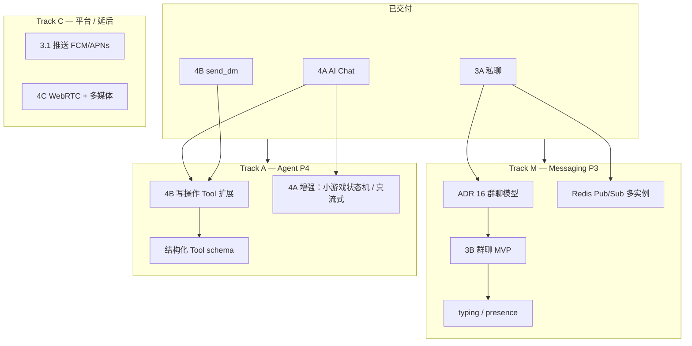

# Phase 3 + 4 后续计划（并行轨道）

> **状态**：规划稿（2026-07-05）  
> **前置**：[phase-3-agent-closeout.md](./phase-3-agent-closeout.md)（3A + 4A + 4B `send_dm` 已交付）  
> **原则**：P3 与 P4 在编号上仍分域；实现上在 **无依赖冲突** 时可并行推进。

---

## 当前已完成切片

| 编号 | 切片 | 状态 |
|------|------|------|
| **3A** | 1:1 私聊（REST + WS + Web `/messages`） | ✅ |
| **4A** | AI Chat MVP（Ollama、SSE、`/ai`、小轨、`search_contact`） | ✅ |
| **4B（部分）** | `send_dm` pending → Approve → 写私聊 + `ai_tool_calls` 审计 | ✅ |

**未做**：3B 群聊、typing、presence、3.1 推送、4B 其余 Tool、4C 音视频/多媒体、Redis 多实例、RAG/LangGraph。

---

## 总览：两条主轨道可并行



| 轨道 | 目标 Phase | 与另一轨道关系 |
|------|------------|----------------|
| **Track M** | 3B、3B+、Redis | 与 Track A **可并行**（不同 schema / 路由 / UI） |
| **Track A** | 4B 扩展、4A 增强 | 与 Track M **可并行**（复用 Phase 2 服务，不依赖群聊） |
| **Track C** | 3.1、4C | **延后**；体量大，不与 3B/4B 首轮抢资源 |

---

## Wave 1 — 建议优先（可双轨并行，约 2–4 周）

### Track M：Messaging（P3 剩余）

| ID | 任务 | 依赖 | 可并行 |
|----|------|------|--------|
| M0 | **ADR 16** — 群聊是否复用 `conversations.type=group` | 3A | 与 A0 并行 |
| M1 | 群聊 schema + migration + `POST /conversations`（group） | M0 | 与 A1 并行 |
| M2 | 群消息 REST + WS 广播（复用 `message-service`） | M1 | 与 A2 并行 |
| M3 | Web 群聊 UI（创建群、成员列表、群聊窗） | M2 | 与 A3 并行 |
| M4 | `typing.start` / `typing.stop` WS 事件（可选 3B+） | 3A WS | 与 A 轨并行 |
| M5 | **Redis Pub/Sub** — 多实例 `message.new` 广播 | ADR 13 扩展 | 部署前；可与 M4 并行 |

**3B 验收**：两用户群聊收发；可选 typing 指示器；单实例下行为与 3A 一致。

### Track A：Agent（P4 剩余）

| ID | 任务 | 依赖 | 可并行 |
|----|------|------|--------|
| A0 | 结构化 Tool schema（LLM function calling 或统一 JSON schema） | 4A | 与 M0 并行 |
| A1 | **`create_post` Tool** — pending + Approve → Phase 2 post 服务 | 4B 审计模式 | 与 M1 并行 |
| A2 | **`follow_user` / `unfollow_user` Tool** | 4B 审计模式 | 与 M2 并行 |
| A3 | 井字棋 **状态机**落库或 session 内存（4A 规划内） | 4A | 与 M3 并行 |
| A4 | SSE **真流式**（provider `stream: true`，非 chunk 模拟） | 4A | 可与 M5 并行 |
| A5 | `LLM_API_KEY` + 生产云 API 配置（env 文档） | 无 | 随时 |

**4B 扩展验收**：`/ai` 触发写 Tool → 确认卡片 → 业务侧可见（Feed / 关注列表）。

### Wave 1 汇合门禁

- [ ] `pnpm type-check` / `lint` / server test / 相关 E2E 通过
- [ ] `api-spec.md` + `shared-types` 与实现同步
- [ ] 至少一条 Track M + 一条 Track A 任务有可演示增量（不必等两轨全做完再 PR）

---

## Wave 2 — 增强与平台（按需，可部分并行）

| ID | 任务 | Phase | 说明 |
|----|------|-------|------|
| W2-M1 | Presence（在线 / 离线，简版） | 3B+ | 依赖 WS；可与 A 轨并行 |
| W2-M2 | Session `session.revoked` WS 通知 | 3B 可选 | 与 auth 联动 |
| W2-A1 | RAG / 文档检索 **评估 ADR**（不做则记录 Deferred） | 4+ | 独立调研轨 |
| W2-A2 | `packages/agent-core` 或 Python Runtime **评估** | 4+ | 仅当 orchestrator 变重 |
| W2-C1 | **3.1** FCM / APNs 推送 | 3.1 | 需移动端或 Web Push 决策 |
| W2-C2 | **4C** WebRTC 信令 + TURN/STUN ADR | 4C | 与 3B 可并行但建议专轨 |

---

## 依赖矩阵（能否并行？）

|  | 3B 群聊 | 4B 新 Tool | typing | Redis | 4C WebRTC |
|--|---------|------------|--------|-------|-----------|
| **3B 群聊** | — | ✅ 并行 | 串行在 3B 后 | ✅ 并行 | ✅ 并行 |
| **4B 新 Tool** | ✅ 并行 | — | ✅ 并行 | ✅ 并行 | ✅ 并行 |
| **typing** | 建议 3B 后 | ✅ 并行 | — | ✅ 并行 | ✅ 并行 |
| **Redis** | 部署前需要 | ✅ 并行 | ✅ 并行 | — | ✅ 并行 |
| **4C WebRTC** | ✅ 并行 | ✅ 并行 | ✅ 并行 | 建议有 Redis | — |

**关键结论**：

- **4B 扩展不依赖 3B** — `create_post`、`follow` 只调 Phase 2 服务 + 现有 `ai_tool_calls` 模式。
- **3B 不依赖 4B** — 群聊只扩展 `conversations` / WS，与 AI 表无关。
- **`send_dm` 已证明 4B→3A 汇合模式** — 后续写 Tool 复用同一套 pending / approve / audit。

---

## 推荐执行顺序（人力有限时）

若 **单人 / 单 Agent 串行**，建议：

1. PR 合并当前 `feat/phase-3-agent`
2. **二选一先跑一条轨**：
   - 偏产品体验 → **M0→M1→M2→M3**（群聊）
   - 偏 Agent → **A0→A1→A2**（更多 Tool + 结构化 schema）
3. 再补另一轨 + Redis（M5）再考虑上线多实例

若 **可开两轨并行**：

```
Agent A（或人）: M0 → M1 → M2 → M3
Agent B（或人）: A0 → A1 → A2 → A3
汇合: E2E（群聊 + Agent Tool 各一条）→ 文档 → PR
```

---

## 文档同步清单（每个 Wave 结束）

| 文档 | 更新内容 |
|------|----------|
| [product.md](./product.md) | 功能表状态、当前阶段 |
| [roadmap.md](./roadmap.md) | Phase 完成度勾选 |
| [api-spec.md](./api-spec.md) | 新端点 / WS 事件 |
| [db-schema.md](./db-schema.md) | 新表或字段 |
| [realtime-spec.md](./realtime-spec.md) | typing / presence / signaling |
| `docs/decisions/` | 新 ADR（16 群聊、媒体存储等） |
| [AGENTS.md](../AGENTS.md) | 会话交接 |

---

## 不在此计划内

- 生产 Compose + Caddy 完整编排
- LangGraph / LlamaIndex 落地实现
- RN 客户端聊天 UI（可另开 `multi-client` 里程碑）
- 个人橱窗（Phase 5）
