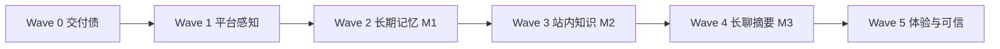

# 小轨（Orbit Guide）完善计划

> **状态**：Wave 1–5 已完成（2026-07-09）  
> **实现学习指南**：[orbit-guide-agent-implementation.md](./orbit-guide-agent-implementation.md)  
> **Agent**：内置 `orbit-guide` / 「小轨」  
> **前置**：Phase 4A + 4B 已交付；当前分支含 SSE 优化（ADR 20）、待合入 master  
> **关联**：[phase-4-agent-memory-rag-plan.md](./phase-4-agent-memory-rag-plan.md)（M1/M2/M3 技术深描）、[ADR 17](./decisions/17-ai-agent-architecture.md)

---

## 1. 愿景与边界

### 1.1 小轨是什么

**站内社交助手**——帮用户在本平台上：

- 聊天、娱乐（井字棋）
- **查**：联系人、自己的资料与动态、（后续）知识片段
- **记**：跨会话偏好与事实（用户可控）
- **做**：发私信、发帖、关注（须用户 Approve，不变）

**不是**：通用搜索引擎、自动发帖机器、未经同意的隐私采集器。

### 1.2 「知识学习」在本项目中的含义

| 层次 | 含义 | 阶段 |
|------|------|------|
| **平台感知** | 知道「你是谁、发过什么、关注了谁」 | Wave 1 |
| **长期记忆** | 跨 AI 会话记住你明确说过的事实 | Wave 2（M1） |
| **站内 RAG** | 从帖子/文档语义检索再回答 | Wave 3（M2） |
| **长聊压缩** | 百轮对话仍记得早期要点 | Wave 4（M3） |
| **模型微调** | 改模型权重 | **不做**（见 memory-rag-plan） |

用户口头说的「知识学习」≈ **Wave 2 + Wave 3**；Wave 1 是低成本前置，让「懂 Orbitchat」先于向量库落地。

---

## 2. 现状基线（2026-07-09）

| 维度 | 现状 |
|------|------|
| 人设 | `agents.system_prompt` 固定一段中文 |
| 上下文 | 单会话最近 **20** 条 `user`/`assistant`（无 `tool` 行） |
| 工具 | `search_contact`、`play_tictactoe`、写工具 ×4（Approve） |
| 游戏状态 | `ai_conversations.tictactoe_data` |
| 流式 | ADR 20 Phase A/B/C（当前分支，待合 master） |
| 跨会话记忆 | ✅（Wave 2 M1） |
| 读 Feed/资料 | ✅（Wave 1 只读 + Wave 3 语义检索） |
| 用户可见记忆管理 | ❌ |

**结论**：能对话、下棋、代操作；**不能**持续「学会」用户或站内知识。

---

## 3. 总路线图



| Wave | 名称 | 周期（估） | 用户可感知变化 |
|------|------|------------|----------------|
| **0** | 交付债 | 1–2 天 | 稳定基线合入 master |
| **1** | 平台感知 | 3–5 天 | 「帮我总结我最近的帖」「我 profile 啥」 |
| **2** | 长期记忆 M1 | 1–1.5 周 | 新开会话仍记得称呼/偏好 |
| **3** | 站内知识 M2 | 1.5–2 周 | 「根据我帖子回答…」带出处 |
| **4** | 长聊摘要 M3 | 3–5 天 | 超长单会话不丢早期信息 |
| **5** | 体验与可信 | 持续 | 记忆管理 UI、引用卡片、建议记忆 |

**推荐顺序**：0 → 1 → 2 → 3 → 4；Wave 5 与 2/3 并行 polish。

---

## 4. Wave 0 — 交付债（必须先做）

**目标**：小轨后续迭代站在干净 master 上。

| # | 任务 |
|---|------|
| 0.1 | `feat/api-robustness-concurrency`：migrate `0009`–`0013`、test/e2e、commit、PR |
| 0.2 | 更新 `phase-3b-4b-closeout.md` / `roadmap.md`（划掉已在分支完成的项） |
| 0.3 | `/ai` 手测：SSE 流式、井字棋、Approve 写工具 |

**门禁**：157+ server tests、E2E 通过、迁移可在空库复现。

---

## 5. Wave 1 — 平台感知（只读扩展）

**目标**：不引入向量库，小轨能**查站内已有数据**并回答。

### 5.1 新只读 Tool

| Tool | 数据 | 权限 |
|------|------|------|
| `get_my_profile` | 当前用户 `profiles` + `users` | 登录用户本人 |
| `list_my_recent_posts` | 本人最近 N 条帖子（cursor/limit） | 本人 |
| `get_user_profile` | 指定 username 的公开 profile | 同 `GET /users/:id` 规则 |
| `list_user_recent_posts` | 指定用户公开帖 | inactive → 404 |

**实现**：`tool-executor` 调现有 `user-service` / `post-service` / `feed-service`，**不**新写 SQL 在 runtime。

### 5.2 System Prompt 升级

- 明确小轨身份、能力边界、必须走 Tool 查数据（禁止编造帖子/粉丝数）
- 注入**轻量会话上下文**：当前用户 `displayName`、`username`（1 条 system 附录，非记忆表）

### 5.3 文档与类型

- `api-spec.md` Tool 列表
- `tools.ts` + `tool-executor.ts` + 单测
- E2E：`[e2e:my_posts]` mock 前缀（可选，与现有 e2e-mock 一致）

### 5.4 验收

- 用户问「我最近发了啥」→ 调 `list_my_recent_posts` → 回答含真实标题片段
- 问不存在用户 → 工具错误或 404 语义，不幻觉

**非目标**：跨会话记忆、语义搜索全站。

### 5.5 Wave 1 实施状态（2026-07-09）✅

| 项 | 状态 |
|----|------|
| `tools.ts` 4 个只读 Tool 定义 | ✅ |
| `tool-executor.ts` 实现 + 单测（7 项） | ✅ |
| `orchestrator` tool hint + 防编造 + `userContext` 注入 | ✅ |
| `DEFAULT_AGENT` system prompt 升级 | ✅ |
| `createAiMessageAndRun` 加载当前用户上下文 | ✅ |
| `docs/api-spec.md` Tool 列表 | ✅ |
| Web `/ai` `describeRunningTool` 文案 | ✅ |
| E2E mock `[e2e:my_posts]` 前缀 + 单测 | ✅ |
| Playwright E2E 场景 | ⏸ 可选，未加 → **已加 5 条 Agent 场景** |

**验收**：164 server tests 通过；server + web type-check 通过。

---

## 6. Wave 2 — 长期记忆 M1

**目标**：跨 AI 会话记住**用户级**少量、可审计、可删除的事实。

> 技术细节见 [phase-4-agent-memory-rag-plan.md § M1](./phase-4-agent-memory-rag-plan.md#m1--长期记忆-mvp)。

### 6.1 数据

表 `user_agent_memories`（`user_id`、`kind`、`content`、`source`、`deleted_at`…）。

**新 ADR**：`docs/decisions/21-agent-memory-model.md`（勿与 ADR 18 API 健壮性混淆）。

### 6.2 API

```
GET    /api/v1/ai/memories          # 当前用户记忆列表
POST   /api/v1/ai/memories          # 用户手动添加
DELETE /api/v1/ai/memories/:id      # 软删
```

### 6.3 写入路径（二选一，建议都做）

| 路径 | 说明 |
|------|------|
| **显式 API** | 设置页「AI 记忆」增删 |
| **Tool `remember_fact`** | LLM 提取 → **默认 pending**，用户 Approve 后落库（与写工具同审计模式） |

**原则**：M1 **禁止**静默从每句话自动抽取（可 Wave 5 做「建议记忆」）。

### 6.4 读取注入

`createAiMessageAndRun` 前：`memory-service.listForUser(userId, { limit: 8 })` → 拼入 system：

```text
## 关于该用户的已知事实（用户可删除）
- 偏好简短回复
- 希望被称为 Orbit
```

### 6.5 验收

- 会话 A：「记住以后叫我 Orbit」→ Approve → 落库
- 新建会话 B：小轨使用正确称呼
- 删除该记忆后：不再注入

### 6.6 Wave 2 实施状态（2026-07-09）✅

| 项 | 状态 |
|----|------|
| ADR 21 + `user_agent_memories` 迁移 `0014` | ✅ |
| `GET/POST/DELETE /api/v1/ai/memories` | ✅ |
| `remember_fact` pending Tool + Approve 落库 | ✅ |
| 会话前注入 Top-8 记忆 | ✅ |
| Web `/ai/memories` 管理页 | ✅ |
| E2E mock `[e2e:remember_fact]` | ✅ |

**验收**：173 server tests 通过；server + web type-check 通过。

---

## 7. Wave 3 — 站内知识 M2

**目标**：基于**用户有权访问**的内容语义检索（RAG 入门）。

### 7.1 基础设施选型（建议）

| 选项 | 建议 |
|------|------|
| 向量存储 | Postgres **pgvector**（与现有栈一致，学习成本低） |
| Embedding | 本地 Ollama embedding 模型或云 API（env 配置） |
| 索引范围 v1 | **本人帖子** + `docs/` 静态帮助 MD（可选） |

**新 ADR**：`docs/decisions/22-agent-rag-boundaries.md`（权限、collection、重建策略）。

### 7.2 管道

1. 帖子 `INSERT/UPDATE` → 异步 job 切块 + embedding（或 MVP：同步 on-write，量小可接受）
2. 表 `knowledge_chunks`（`source_type`, `source_id`, `text`, `owner_user_id`, `embedding`）

### 7.3 Tool

| Tool | 行为 |
|------|------|
| `search_my_posts` | 语义检索本人帖子 Top-K，返回摘要 + `postId` |
| `search_help_docs` | 检索产品/帮助文档（全员可读） |

Orchestrator：**走 Tool**，不每次请求全库扫描。

### 7.4 验收

- 「我有没有发过关于旅行的帖」→ 命中测试帖 + 回答带 `postId`/摘要
- 不能检索他人私密 DM、无权限内容

**M2-lite 备选**（若 pgvector 过重）：Wave 1 的 `list_my_recent_posts` + 关键词过滤先行，Wave 3 再上向量。

### 7.5 Wave 3 实施状态（2026-07-09）✅

| 项 | 状态 |
|----|------|
| ADR 22 + `knowledge_chunks` 迁移 `0015` + pgvector | ✅ |
| `EMBEDDING_*` / `RAG_ENABLED` env + Docker pgvector 镜像 | ✅ |
| `embedding-provider` + `rag-service`（向量 + ILIKE 降级） | ✅ |
| 帖子 on-write 索引 + `search_my_posts` / `search_help_docs` Tool | ✅ |
| 启动时 `ensureHelpDocsIndexed`（`RAG_ENABLED`） | ✅ |
| 开发恢复脚本 `bun scripts/reindex-rag.ts` | ✅ |
| E2E mock `[e2e:search_posts]` / `[e2e:search_help]` | ✅ |

**验收**：184 server tests 通过；server + web type-check 通过。手测需 migrate `0015` + 拉取 `nomic-embed-text` embedding 模型。

---

## 8. Wave 4 — 长聊摘要 M3

**目标**：单会话超过阈值后，早期内容压缩为摘要，与最近 20 条一并注入。

- 表 `ai_conversation_summaries`
- 触发：每 30 条消息或 token 估算超阈
- `loadRuntimeHistory` → `summary + recent 20`

验收：100 轮后仍能答对会话早期关键事实（在摘要覆盖范围内）。

### 8.1 Wave 4 实施状态（2026-07-09）✅

| 项 | 状态 |
|----|------|
| `ai_conversation_summaries` 表 + migration `0016` | ✅ |
| `maybeRefreshConversationSummary`（>30 条触发） | ✅ |
| `loadRuntimeContext` + `conversationSummary` 注入 | ✅ |
| `summary-service` 单测 + orchestrator 单测 | ✅ |

**验收**：194 server tests 通过。

---

## 9. Wave 5 — 体验与可信（持续）

| 项 | 说明 |
|----|------|
| **记忆管理 UI** | `/ai/settings` 或 Profile 子页：列表、删除、手动添加 |
| **引用卡片** | RAG / 帖子工具结果在气泡下展示「依据：帖子 xxx」 |
| **建议记忆** | 小轨说「要不要记住你喜欢简短回复？」→ 一键确认 |
| **人设迭代** | 分场景 prompt 模块（社交建议 vs 下棋 vs 查资料） |
| **失败可恢复** | LLM 不可用时的友好文案（已有 SSE error，补 UI） |

### 9.1 Wave 5 实施状态（2026-07-09）✅ MVP

| 项 | 状态 | 说明 |
|----|------|------|
| 记忆管理 UI | ✅ | `/ai/memories` |
| Approve 写工具 UI | ✅ | `/ai` pending 卡片 |
| SSE tool 进度文案 | ✅ | `describeRunningTool` |
| 引用卡片（RAG/帖子出处） | ✅ | `.ai-citation` 芯片 |
| `remember_fact` 卡片说明 + 记忆页链接 | ✅ | pending 卡片 helper |
| 分场景 prompt 模块 | ✅ | `prompt-modules.ts` |
| LLM 失败友好 UI | ✅ | `formatAiError` 中文文案 + 重试提示 |
| 建议记忆（一键确认） | ⏸ 远期 | 仍走 `remember_fact` Approve；无 LLM 主动提议 UI |

---

## 10. 小轨能力演进一览

| 能力 | 现在 | W1 | W2 | W3 | W4 |
|------|------|----|----|----|-----|
| 闲聊 / 笑话 | ✅ | ✅ | ✅ | ✅ | ✅ |
| 井字棋 | ✅ | ✅ | ✅ | ✅ | ✅ |
| 搜联系人 | ✅ | ✅ | ✅ | ✅ | ✅ |
| 写操作 Approve | ✅ | ✅ | ✅ | ✅ | ✅ |
| 查本人资料/帖 | ✅ | ✅ | ✅ | ✅ | ✅ |
| 跨会话记忆 | ✅ | ✅ | ✅ | ✅ | ✅ |
| 语义查帖/RAG | ✅ | ❌ | ❌ | ✅ | ✅ |
| 超长会话摘要 | ✅ | ❌ | ❌ | ❌ | ✅ |

---

## 11. 非目标（全 Wave）

- Per-user 微调模型
- 未经同意的隐式记忆
- Agent 自动改 `agents.system_prompt`
- 代替用户自动执行写操作（无 Approve）
- 全站爬取 / 读他人私信做 RAG
- LangChain / LangGraph 引入（除非 M3 后评估编排复杂度）

---

## 12. 建议下一迭代（可立刻开工）

若只选 **一个最小增量**（Wave 0 之后）：

**Wave 1 — `get_my_profile` + `list_my_recent_posts` + prompt 升级**

- 不改 DB schema
- 1 个 PR 可 review
- 用户立刻感到「小轨懂 Orbitchat 了」

然后开 **Wave 2 M1** 专项分支。

---

## 13. 相关文档

| 文档 | 用途 |
|------|------|
| [phase-4-agent-memory-rag-plan.md](./phase-4-agent-memory-rag-plan.md) | M1/M2/M3 表结构、注入伪代码 |
| [decisions/17-ai-agent-architecture.md](./decisions/17-ai-agent-architecture.md) | Runtime / Tool 边界 |
| [decisions/20-ai-sse-streaming.md](./decisions/20-ai-sse-streaming.md) | SSE 流式 |
| [api-spec.md](./api-spec.md) | `/api/v1/ai/*` |
| [db-schema.md](./db-schema.md) | `ai_*` 表 |
| [orbit-guide-agent-implementation.md](./orbit-guide-agent-implementation.md) | 实现学习指南（链路、目录、扩展） |

---

**最后更新**：2026-07-09（补充 Wave 4/5 实施状态表）
