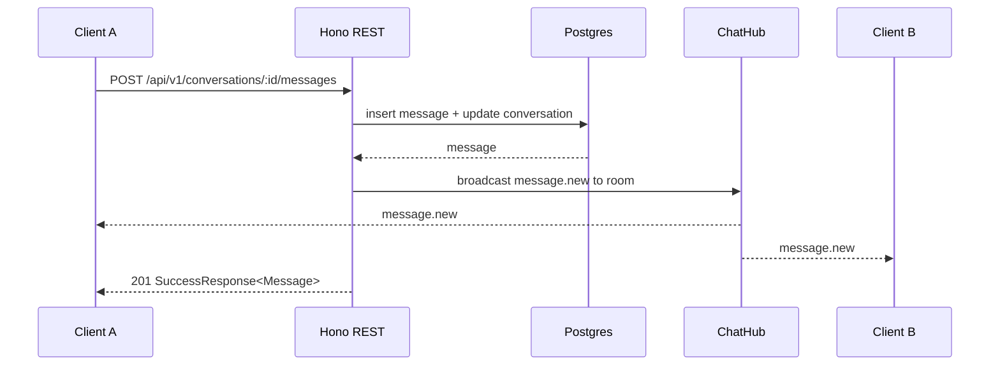

# 实时通信规范 - Orbitchat

> **文档状态**：Living Document（活文档）  
> **当前版本**：0.2.0 Phase 3A 草案
> **详细协议**：Phase 3A 实现时同步到 `@orbitchat/shared-types`。

## 概览

Orbitchat 实时能力分两类：

| 类型 | 阶段 | 传输 | 用途 |
|------|------|------|------|
| **文字消息** | Phase 3 | WebSocket | 私聊、群聊 |
| **音视频信令** | Phase 4 | WebSocket + WebRTC | 通话建立、ICE、SDP |
| **Session 事件** | Phase 3 可选 | WebSocket | 多端踢下线通知 |

REST API 负责历史消息拉取、会话列表；实时推送走 WebSocket。

**相关**：[multi-client.md](./multi-client.md)、[api-spec.md](./api-spec.md)

---

## 技术决策

Phase 3A 依据：

- [ADR 13 — WebSocket 栈与连接管理](./decisions/13-websocket-stack.md)
- [ADR 14 — 消息写入与投递模型](./decisions/14-message-delivery.md)
- [ADR 15 — 1:1 会话与消息模型](./decisions/15-conversation-model.md)

决策摘要：

- `WS /ws/v1/chat` 使用 Bun/Hono 原生 WebSocket。
- 单实例 in-memory `ChatHub`，多实例 Redis Pub/Sub 延后。
- 发送消息走 REST POST；WebSocket 只推实时增量。
- Phase 3A：1:1 私聊；Phase 3B：群聊；Phase 3B.1：**1:1 typing** + 群成员管理 WS 事件。
- 群聊 typing、presence 不做。

---

## 连接

### 端点

```
WS /ws/v1/chat          # 文字聊天
WS /ws/v1/signaling     # WebRTC 信令（Phase 4）
```

Phase 3A 只实现 `/ws/v1/chat`。

### 握手参数

```
Query: ?token=<access_token>&deviceId=<device_id>&platform=web
Header: X-Device-Id, X-Client-Platform
```

- 浏览器 WebSocket 无法设置自定义 Header；Web 客户端必须通过 query 传 `deviceId` 与 `platform`。
- 原生客户端优先使用 Header；query 作为 Web 回退。

- 服务端校验 JWT + Session 未 revoke
- 连接与用户 / Session 绑定，便于按 Session 推送 `session.revoked`
- `X-Client-Version` 推荐携带；缺失时允许连接但记录日志
- 鉴权失败直接拒绝 upgrade 或连接后发送 `error` 并关闭

---

## 连接生命周期

1. 客户端登录后建立 `WS /ws/v1/chat?token=<access_token>`。
2. 服务端校验 JWT、Session、Device ID。
3. 服务端生成 `connectionId`，写入 `ChatHub` 内存索引。
4. 服务端发送 `connection.ready`。
5. 客户端通过 REST 拉取会话列表与当前会话历史。
6. 服务端按用户已加入会话将连接加入对应 room，或在 REST 查询 / 打开会话后懒加载加入。
7. 断线后客户端重连，并通过 REST 拉取历史补齐缺失消息。

服务端不保证 WS 事件重放；DB 是事实来源。

---

## Heartbeat

Phase 3A 使用应用层 heartbeat，便于多端统一：

| type | 方向 | 说明 |
|------|------|------|
| `ping` | S→C | 服务端每 25-30s 发送 |
| `pong` | C→S | 客户端收到后尽快回应 |

客户端 60-90s 未收到 `ping` 或连接关闭时应重连。服务端长时间未收到 `pong` 可关闭连接。

---

## 消息 Envelope

所有 WS 帧为 JSON 文本：

```typescript
interface WsMessage<T = unknown> {
  type: string;       // 事件类型，如 'message.new'
  payload: T;
  timestamp: string;  // ISO 8601
  requestId?: string; // 客户端关联用
}
```

### 命名约定

- 格式：`<domain>.<action>`，如 `message.new`、`message.read`、`session.revoked`
- 使用过去分词表示状态：`typing.started` / `typing.stopped`

---

## Phase 3 计划事件（占位）

| type | 方向 | 说明 |
|------|------|------|
| `connection.ready` | S→C | 连接鉴权完成 |
| `ping` | S→C | 心跳 |
| `pong` | C→S | 心跳响应 |
| `message.new` | S→C | 新消息 |
| `message.ack` | C→S | 客户端收到消息（3A 可选） |
| `message.read` | S→C | 会话已读时间更新 |
| `message.recalled` | S→C | 消息撤回（系统提示，非普通消息） |
| `typing.started` | C→S→C | **仅 1:1**；输入中 |
| `typing.stopped` | C→S→C | **仅 1:1**；停止输入 |
| `member.joined` | S→C | 群成员加入（拉人/再入群） |
| `member.left` | S→C | 群成员离开或被踢 |
| `error` | S→C | WS 错误 |
| `presence.online` | S→C | Phase 3B+ 可选 |
| `session.revoked` | S→C | Phase 3B+ 可选 |

---

## Phase 3A Payload

### `connection.ready`

```typescript
interface ConnectionReadyPayload {
  connectionId: string;
  userId: string;
  sessionId: string;
  connectedAt: string;
}
```

### `message.new`

由服务端在 REST 写库成功后广播。

```typescript
interface MessageNewPayload {
  conversationId: string;
  message: {
    id: string;
    conversationId: string;
    sender: {
      id: string;
      username: string;
      displayName: string;
      avatarUrl: string | null;
    };
    content: string;
    createdAt: string;
    editedAt: string | null;
    deletedAt: string | null;
  };
}
```

客户端应按 `message.id` 去重，因为发送者会同时收到 REST response 与 WS `message.new`。

### `message.ack`

客户端收到 `message.new` 后可回传。Phase 3A 不把 ack 作为持久化送达状态。

```typescript
interface MessageAckPayload {
  conversationId: string;
  messageId: string;
  receivedAt: string;
}
```

### `message.read`

Phase 3A 使用 `last_read_at` 简化已读。客户端通过 REST `PATCH /api/v1/conversations/:id/read` 更新；服务端广播该事件给同会话成员。

```typescript
interface MessageReadPayload {
  conversationId: string;
  userId: string;
  lastReadAt: string;
}
```

### `message.recalled`

消息撤回时广播。payload 携带 `MessageRecall` 系统事件（**不写入 `messages` 表**），客户端应在原消息位置展示「XX 撤回了一条消息」，并移除原消息气泡。离线用户拉历史时通过 `GET .../messages` 响应中的 `recalls` 数组还原时间轴。

```typescript
interface MessageRecall {
  id: string;
  conversationId: string;
  messageId: string;
  recalledBy: ConversationParticipant;
  messageCreatedAt: string; // 时间轴定位（原消息发送时间）
  recalledAt: string;
}

interface MessageRecalledPayload {
  conversationId: string;
  recall: MessageRecall;
}
```

### `typing.started` / `typing.stopped`

**仅 1:1 direct 会话**。群聊发送 typing 帧时服务端返回 `error`（`VALIDATION_ERROR`）。

客户端 → 服务端（发送者只需带 `conversationId`）：

```typescript
interface ClientTypingPayload {
  conversationId: string;
}
```

服务端 → 对方连接（排除发送者；附带发送者展示名）：

```typescript
interface TypingPayload {
  conversationId: string;
  userId: string;
  displayName: string;
}
```

建议：客户端在输入时发 `typing.started`，停止输入或超时后发 `typing.stopped`；服务端不做持久化。

### `member.joined`

群成员被拉入或重新入群时广播给该群 room 内所有在线成员。

```typescript
interface MemberJoinedPayload {
  conversationId: string;
  member: {
    id: string;
    username: string;
    displayName: string;
    avatarUrl: string | null;
    role: 'owner' | 'admin' | 'member';
    joinedAt: string;
  };
}
```

### `member.left`

成员主动退群或被踢时广播。

```typescript
interface MemberLeftPayload {
  conversationId: string;
  userId: string;
  reason: 'kicked' | 'left';
}
```

### `error`

```typescript
interface WsErrorPayload {
  code: string;
  message: string;
  details?: unknown;
}
```

常见 code：

| code | 说明 |
|------|------|
| `UNAUTHORIZED` | Token / Session 无效 |
| `FORBIDDEN` | 无权加入或接收某 room |
| `INVALID_MESSAGE` | WS frame 格式无效 |
| `RATE_LIMITED` | 发送频率过高 |
| `INTERNAL_ERROR` | 未预期错误 |

---

## 房间模型

- **所有会话**（1:1 与群聊）：roomId = `conversation:{conversationId}`
- **通话信令**：roomId = `call:{callSessionId}`；Phase 4C

加入 / 离开 room 由服务端根据 DB membership 管理，客户端不直接发送 join room 命令。广播必须通过 `roomId -> Set<connectionId>` 精准发送。Typing 广播使用 `broadcastExcept` 排除发送者本人。

---

## 与 REST 分工

| 操作 | 通道 |
|------|------|
| 发送消息（可离线） | REST POST + WS 推送 |
| 拉取历史 | REST GET paginated |
| 实时送达 | WS |
| 创建群 / 邀请 | REST |

### 发送消息时序



如果 WS 事件丢失，客户端刷新或重连后通过 REST 历史补齐。

---

## 限流与大小

- 单条文字消息：1..2000 字符。
- 单个 WS frame 建议不超过 16KB。
- Phase 3A 可先做连接级基础限流；房间级限流在 3B 大群时补充。
- 图片、文件、语音、视频不走 WS frame。

---

## 多实例与扩展

Phase 3A：

- 单实例 in-memory Hub。
- 目标：1:1 私聊与轻量小群前置能力。

Scale 阶段：

- 多个 `apps/server` 副本。
- 每个实例只管理本机连接。
- Redis Pub/Sub 按 `roomId` 转发跨实例事件。
- Presence TTL、typing、大群限流另行设计。

多人通话 / 直播：

- WebSocket 只做信令。
- 媒体流走 WebRTC / SFU / 直播基础设施。

---

## 维护策略

1. **Phase 3 启动前**：定稿连接、envelope、核心事件列表
2. **每个 WS 事件实现时**：更新 payload 类型 + `shared-types`
3. **Phase 4 音视频**：新增 `signaling.*` 事件章节，不修改文字聊天章节

---

## 版本历史

| 版本 | 日期 | 说明 |
|------|------|------|
| 0.1.0 | 2026-06-14 | 骨架与维护策略 |
| 0.2.0 | 2026-07-03 | Phase 3A 连接、heartbeat、payload、REST+WS 时序 |
| 0.3.0 | 2026-07-06 | 1:1 typing、群成员 `member.joined`/`member.left`；统一 roomId |
